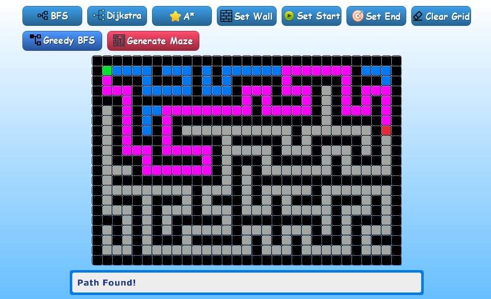

# Pathfinding Visualizer

 <!-- Placeholder for a demo GIF or screenshot; replace with actual if available -->

## Overview

This project is a **Pathfinding Visualizer** built in C++ using the [Raylib](https://www.raylib.com/) library for GUI and graphics rendering. It allows users to interactively visualize various shortest path algorithms on a grid-based environment. Users can set start and end points, add walls as obstacles, generate mazes, and watch the algorithms find paths in real-time. The visualizer supports step-by-step execution to demonstrate how each algorithm explores the grid.

## Features

- Interactive grid where users can:
  - Set start and end cells.
  - Add or remove walls (obstacles).
  - Clear the grid.
- Real-time visualization of pathfinding algorithms with pending, visited, and final path highlighting.
- Step-by-step animation of algorithms for better understanding.
- Support for diagonal movements with wall checks (In Dijkstra, A*, Greedy BFS --> Change max_i to 8 to support diagonal movement).
- Maze generation with animated construction.
- Simple toolbar UI for selecting actions and algorithms.

## Algorithms Implemented

### Shortest Path Algorithms
- **BFS (Breadth-First Search)**: Explores all directions level by level, guaranteeing the shortest path in unweighted grids.
- **Dijkstra's Algorithm**: Finds the shortest path in weighted graphs (here, with uniform or diagonal costs).
- **A* (A-Star)**: An informed search algorithm using heuristics (Manhattan or Euclidean distance) for efficient pathfinding.
- **Greedy Best-First Search (GBFS)**: Prioritizes nodes closest to the goal using heuristics, but does not guarantee optimality.

### Maze Generation Algorithms
- **DFS Backtracking**: Generates mazes by recursively carving paths with backtracking for dead-ends.
- **Prim's Algorithm**: Builds mazes by growing a spanning tree, starting from a random cell and connecting unvisited neighbors.

## GUI Library
This project uses **Raylib**, a simple and easy-to-use library for video game programming, which handles window creation, drawing, input, and more. Raylib is lightweight and cross-platform, making the visualizer portable across Windows, macOS, and Linux.

## Installation and Setup

### Prerequisites
- C++ compiler (e.g., g++ via MinGW on Windows, or clang/gcc on macOS/Linux).
- [Raylib](https://www.raylib.com/) library installed. Follow the [official installation guide](https://github.com/raysan5/raylib/wiki/Working-on-GNU-Linux) for your platform.
- Basic assets (images for buttons) are assumed to be in the `assets/img/` directory as referenced in the code.
- You can also install Raylib using vcpkg since it's easier :D

### Building the Project
1. Clone the repository:
   ```
   git clone https://github.com/yourusername/pathfinding-visualizer.git
   cd pathfinding-visualizer
   ```
2. Compile the source files (assuming Raylib is installed and linked):
   - Complie manually on Visual Studio IDE.
3. Run the program from Visual Studio IDE

## Usage

1. Launch the application.
2. Use the toolbar buttons to:
   - Select and run a pathfinding algorithm (BFS, Dijkstra, A*, Greedy BFS).
   - Set start/end points or add walls by clicking on the grid.
   - Generate a maze (choose DFS or Prim's via keyboard after clicking the button).
   - Clear the grid.
3. Click on the grid to place elements (start, end, walls) based on the selected mode.
4. Watch the algorithm animate step-by-step. Paths are highlighted in magenta once found.
5. Status messages appear at the bottom for guidance.

### Controls
- Mouse: Click on toolbar buttons or grid cells.
- Keyboard (during maze generation): 'P' for Prim's, 'D' for DFS, 'E' to exit mode.
- Keyboard (during setting walls): 'E' to exit mode.

## Dependencies
- **Raylib**: For GUI, input, and rendering.
- Standard C++ libraries (e.g., `<vector>`, `<queue>`, `<stack>`, `<random>`).

No additional external dependencies beyond Raylib.

## Contributing
Feel free to fork the repository and submit pull requests for improvements, such as adding more algorithms or enhancing the UI.
